advent of code 2022
===================

[https://adventofcode.com/2022]

<!-- AOC TILES BEGIN -->
<h1 align="center">
  2022 - 50 ⭐ - Python
</h1>
<a href="day01/__init__.py">
  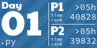
</a>
<a href="day02/__init__.py">
  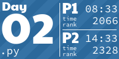
</a>
<a href="day03/__init__.py">
  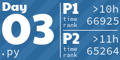
</a>
<a href="day04/__init__.py">
  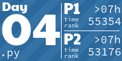
</a>
<a href="day05/__init__.py">
  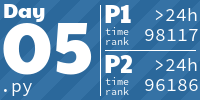
</a>
<a href="day06/__init__.py">
  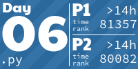
</a>
<a href="day07/__init__.py">
  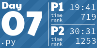
</a>
<a href="day08/__init__.py">
  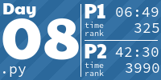
</a>
<a href="day09/__init__.py">
  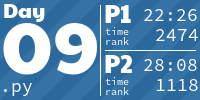
</a>
<a href="day10/__init__.py">
  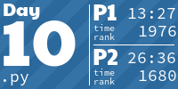
</a>
<a href="day11/__init__.py">
  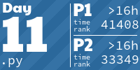
</a>
<a href="day12/__init__.py">
  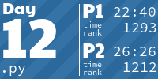
</a>

<a href="day15/__init__.py">
  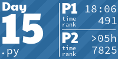
</a>
<a href="day16/__init__.py">
  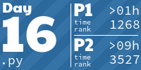
</a>
<a href="day17/__init__.py">
  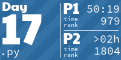
</a>
<a href="day18/__init__.py">
  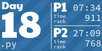
</a>
<a href="day19/__init__.py">
  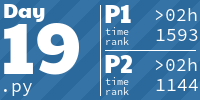
</a>
<a href="day20/__init__.py">
  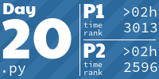
</a>
<a href="day21/__init__.py">
  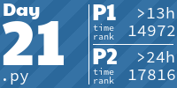
</a>
<a href="day22/__init__.py">
  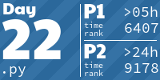
</a>
<a href="day23/__init__.py">
  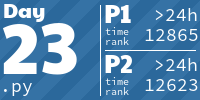
</a>
<a href="day24/__init__.py">
  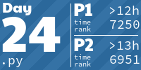
</a>
<a href="day25/__init__.py">
  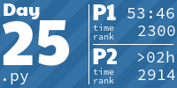
</a>
<!-- AOC TILES END -->

My codes used for advent of code 2022

Initial setup based on [https://github.com/anthonywritescode/aoc2022]
