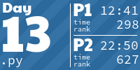

advent of code 2022
===================

[https://adventofcode.com/2022]

<!-- AOC TILES BEGIN -->
<h1 align="center">
  2022 - 50 ⭐ - Python
</h1>

<!-- AOC TILES END -->

My codes used for advent of code 2022

Initial setup based on [https://github.com/anthonywritescode/aoc2022]
